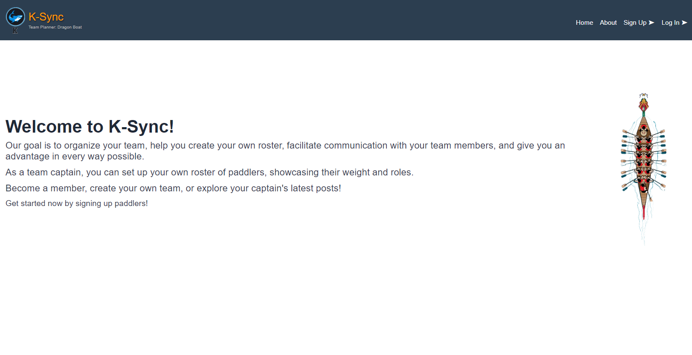
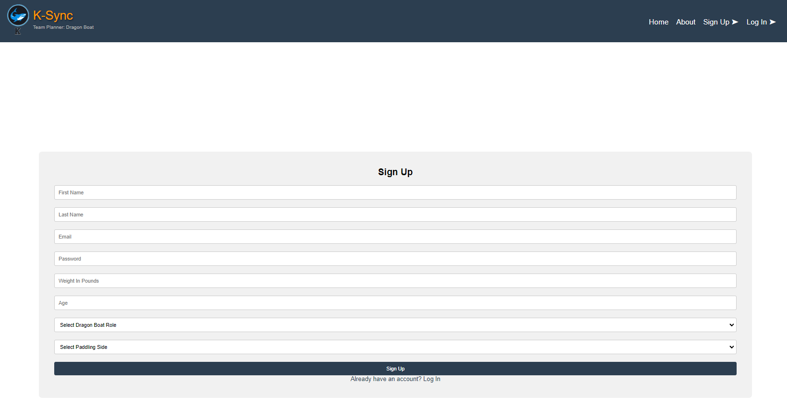
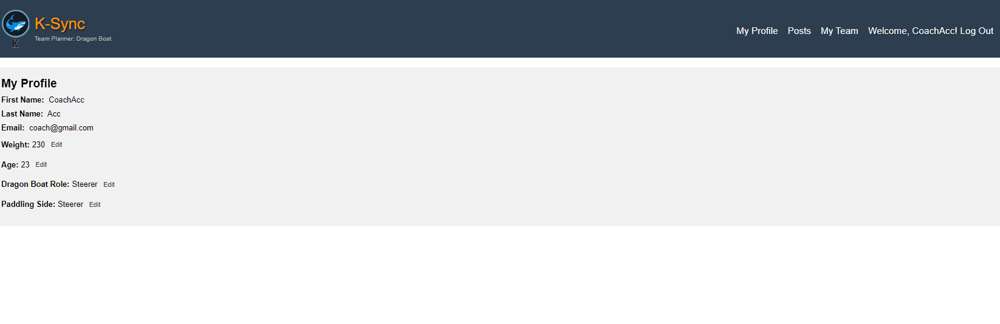
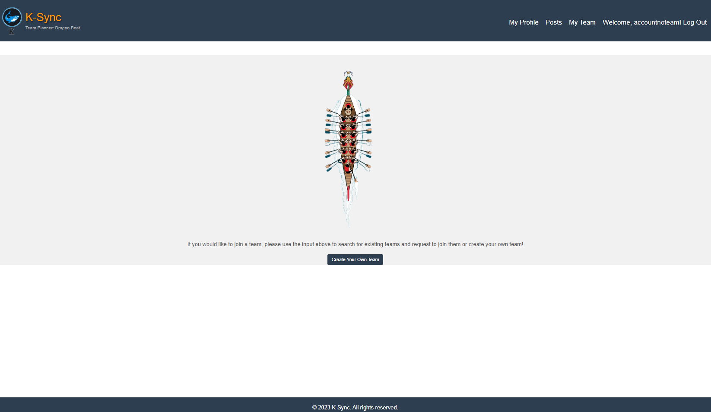
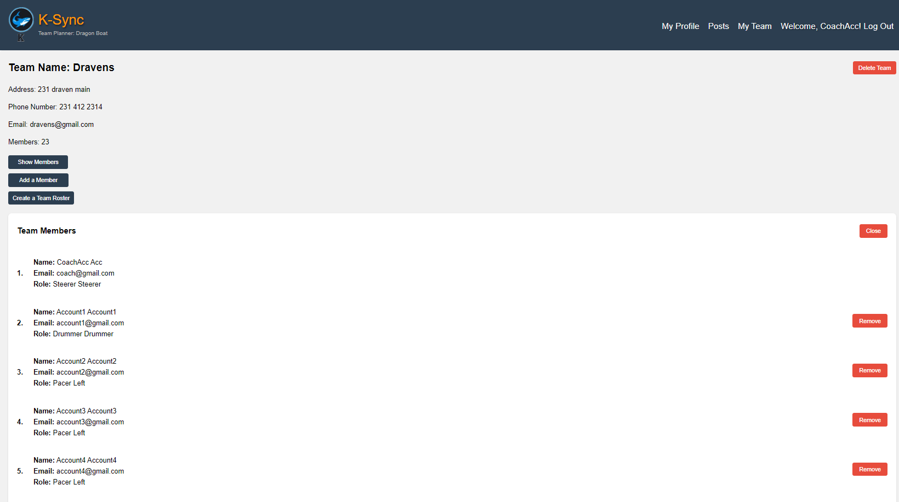
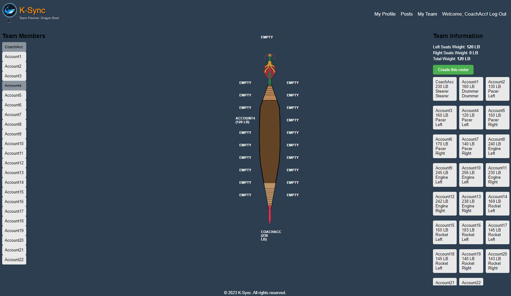
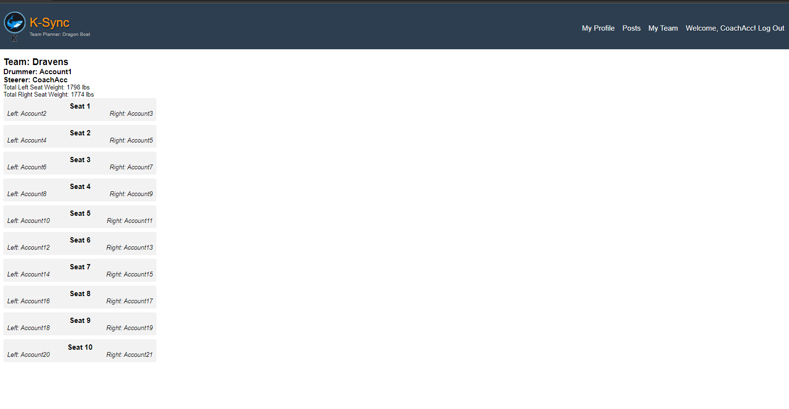

# K-Sync Dragon Boat Website

---

---

Welcome to K-Sync! This website is all about the exciting sport of dragon boat racing. Dragon boat racing is a team water sport that involves synchronized paddling in long, narrow boats decorated like dragon heads and tails. It's a thrilling and competitive sport that requires teamwork, coordination, and strength.

At K-Sync, we aim to connect team members with their captains and provide tools to enhance their performance. Our platform offers a "Create a Roster" feature, which helps teams balance their boats by organizing and managing team members effectively and many more features! 

-----------------------------------------------------------------------------------------------------------------------------------------------------------

---

---

First thing we have is the Signup page of the website , it will record all the information inputed by the user in MongoDb so we can use them later in the 
future to further make information that is relative! The user will be responsible into making their own database. 

----------------------------------------------------------------------------------------------------------------------------------------------------------

---

---

Upon logging in on the account that has been created by the user. This profile page will appear, it has all the information that the user chose,
it also has the option to update the information in complete dynamic way that would update also the database , for weight , age , paddlingside and dragonBoatRole. 

---------------------------------------------------------------------------------------------------------------------------------------------------------

---

---

When the user goes to my team , a message will appear that they are not part of any team. they can either be added to a team by the team captain of another team or they can create their own team! if they already joined a team they wont be seeing this page. 

---

---

When the user creates their own team, they will be named team captain! then can not remove themselves from the team, but they can add , remove or delete the team entirely , then the user will be able to join another team! 

----------------------------------------------------------------------------------------------------------------------------------------------------------

---

---

The MVP of my project! the roster maker feature that is accessable from my team only if you are the team captain of your team. it renders all your team members then you can pick and drop members into the boat at the same time it would calculate each side of the boat, on the side , there is also a team information on the side to help you make that team. click on them if they are already picked and dropped the member will be uncrossed and ready to be picked and dropped somewhere else on the boat. 

----------------------------------------------------------------------------------------------------------------------------------------------------------

---

---

Finally, when the user create roster , their roster will be posted only for the team members to see! automatically, anybody with this team that is loggedin will be able to see the roster of the team, then if the user wants to change the roster, they would just need to create roster feature again, then it will automatically update the posts so only team members can see them. other accounts will have their own posts, if they dont have a team or a roster, it would  show, that (no team or no roster) or (no team and no roster).

-----------------------------------------------------------------------------------------------------------------------------------------------------------

And this is it , my final project! I had a blast making this. It will be under further improvements like always ! 😉
Made with ❤️ By yours truly Karam Salom Hamwi. 

---

  

Check out my [portfolio](https://personal-portfolio-phi-lac.vercel.app/)!
---